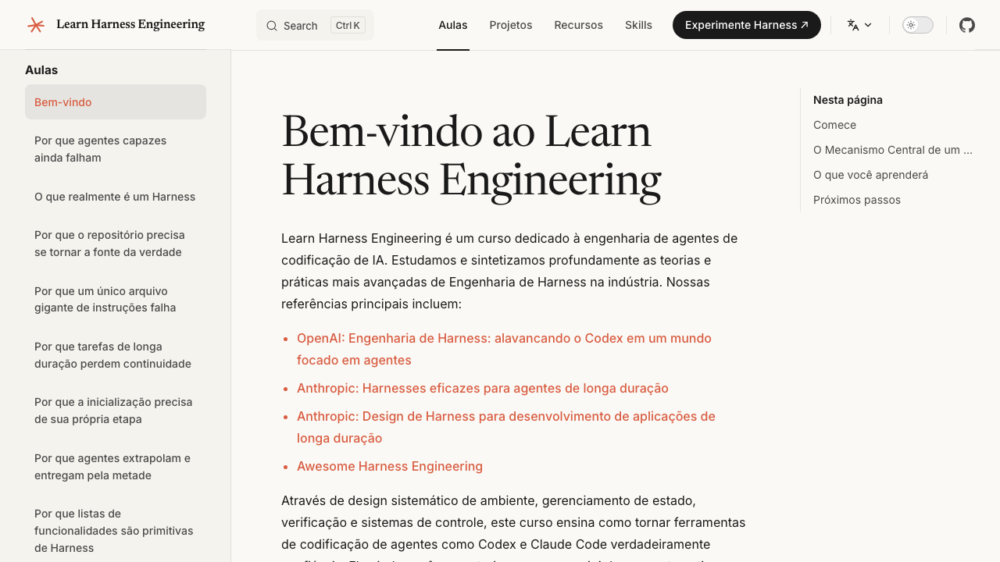
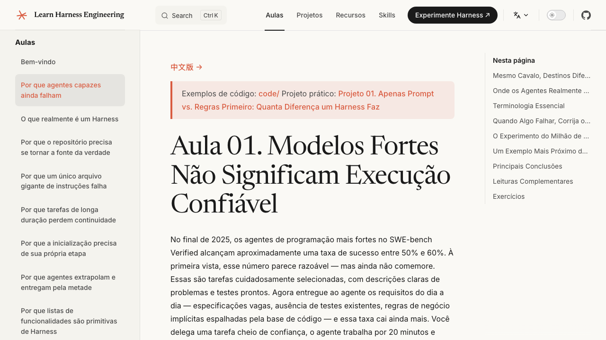
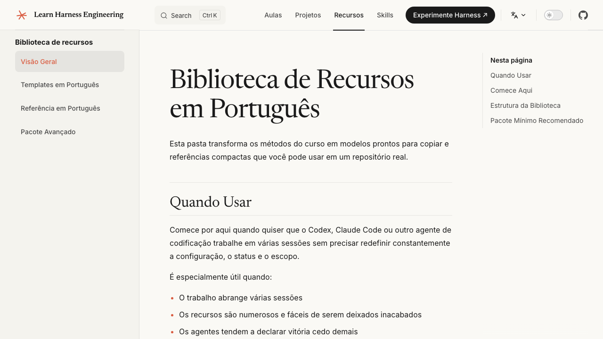

<p align="center">
  <a href="../../README.md"></a>
  <a href="../zh-CN/README.md"></a>
  <a href="../zh-TW/README.md"></a>
  <a href="../ja-JP/README.md"></a>
  <a href="../ko-KR/README.md"></a>
  <a href="../es-ES/README.md"></a>
  <a href="../fr-FR/README.md"></a>
  <a href="../ru-RU/README.md"></a>
  <a href="../de-DE/README.md"></a>
  <a href="../ar-SA/README.md"></a>
  <a href="../vi-VN/README.md"></a>
  <a href="../uz-UZ/README.md"></a>
  <a href="../tr-TR/README.md"></a>
  <a href="../pt-BR/README.md"></a>
</p>

# Aprenda Engenharia de Harness

> **Um curso baseado em projetos sobre a construção do ambiente, gerenciamento de estado, verificação e mecanismos de controle que fazem os agentes de codificação de IA funcionarem de forma confiável.**

<p align="center">
  
  
  
  
</p>

> **Ícone do Globo** Este curso está disponível em **14 idiomas**: Inglês, 简体中文, 繁體中文, 日本語, 한국어, Español, Français, Русский, Deutsch, العربية, Tiếng Việt, Oʻzbekcha, Português (BR). Escolha seu idioma nos selos acima.

Aprenda Engenharia de Harness é um curso dedicado à engenharia de agentes de codificação de IA. Estudamos e sintetizamos profundamente as mais avançadas teorias e práticas de Engenharia de Harness na indústria. Nossas principais referências incluem:

- [OpenAI: Engenharia de Harness: aproveitando o Codex em um mundo focado em agentes](https://openai.com/index/harness-engineering/)
- [Anthropic: Harnesses eficazes para agentes de longa duração](https://www.anthropic.com/engineering/effective-harnesses-for-long-running-agents)
- [Anthropic: Design de Harness para desenvolvimento de aplicativos de longa duração](https://www.anthropic.com/engineering/harness-design-long-running-apps)
- [Awesome Harness Engineering](https://github.com/walkinglabs/awesome-harness-engineering)

> **Início rápido?** A skill [`skills/harness-creator/`](./skills/) pode ajudá-lo a criar um harness de nível de produção (AGENTS.md, listas de recursos, init.sh, fluxos de trabalho de verificação) para seu próprio projeto em minutos.

---

## Sumário

- [Aprenda Engenharia de Harness](#aprenda-engenharia-de-harness)
  - [Sumário](#sumário)
  - [✨ Prévia Visual](#-prévia-visual)
    - [🏠 Página Inicial do Curso](#-página-inicial-do-curso)
    - [📖 Aulas Imersivas](#-aulas-imersivas)
    - [🗂️ Biblioteca de Recursos Pronta para Uso](#️-biblioteca-de-recursos-pronta-para-uso)
  - [Livros do Curso em PDF](#livros-do-curso-em-pdf)
  - [O Modelo é Inteligente, o Harness o Torna Confiável](#o-modelo-é-inteligente-o-harness-o-torna-confiável)
  - [O Que a Engenharia de Harness Realmente Significa](#o-que-a-engenharia-de-harness-realmente-significa)
  - [Por Que Este Curso Existe](#por-que-este-curso-existe)
  - [Currículo e Documentação do Curso](#currículo-e-documentação-do-curso)
  - [Início Rápido: Melhore Seu Agente Hoje](#início-rápido-melhore-seu-agente-hoje)
  - [Projeto Final: Um Aplicativo Real](#projeto-final-um-aplicativo-real)
  - [Referências Principais](#referências-principais)
  - [Estrutura do Repositório](#estrutura-do-repositório)
  - [Como o Curso é Organizado](#como-o-curso-é-organizado)
  - [Habilidades](#habilidades)
  - [Outros Cursos](#outros-cursos)
  - [Histórico de Estrelas](#histórico-de-estrelas)
  - [Agradecimentos](#agradecimentos)

---

## ✨ Prévia Visual

### 🏠 Página Inicial do Curso
> Um esboço abrangente do curso e introdução às filosofias centrais, fornecendo um caminho claro para começar.



### 📖 Aulas Imersivas
> Aprofundamentos em problemas do mundo real e projetos práticos (como o Projeto 01) para uma experiência de aprendizado imersiva.



### 🗂️ Biblioteca de Recursos Pronta para Uso
> Modelos e configurações de referência projetados para resolver armadilhas comuns no desenvolvimento de agentes de IA multi-turn, como perda de contexto e conclusão prematura de tarefas.



## Livros do Curso em PDF

O repositório agora inclui um pipeline de construção de PDF para o conteúdo do curso.

- Execute `npm run pdf:build` para gerar os livros do curso em PDF configurados localmente.
- Os arquivos de saída são gravados em `artifacts/pdfs/`.
- Execute `npm run screenshots:readme` se quiser atualizar as imagens de prévia do README.
- O fluxo de trabalho do GitHub Actions [`release-course-pdfs.yml`](./.github/workflows/release-course-pdfs.yml) pode construir os PDFs e publicá-los nos Lançamentos do GitHub.

---

## O Modelo é Inteligente, o Harness o Torna Confiável

Há uma dura verdade que a maioria das pessoas aprende da maneira mais difícil: **o modelo mais forte do mundo ainda falhará em tarefas de engenharia reais se você não construir um ambiente adequado ao seu redor.**

Você provavelmente já viu isso. Você dá uma tarefa ao Claude ou GPT em seu repositório. Ele começa bem — lê arquivos, escreve código, parece produtivo. Então algo dá errado. Ele pula uma etapa. Ele quebra um teste. Ele diz "feito", mas nada realmente funciona. Você gasta mais tempo limpando do que se tivesse feito você mesmo.

Isso não é um problema do modelo. É um problema do harness.

A evidência é clara. A Anthropic realizou um experimento controlado: o mesmo modelo (Opus 4.5), o mesmo prompt ("construir um editor de jogos retrô 2D"). Sem um harness, ele gastou $9 em 20 minutos e produziu algo que não funcionou. Com um harness completo (planejador + gerador + avaliador), ele gastou $200 em 6 horas e construiu um jogo que você realmente poderia jogar. O modelo não mudou. O harness mudou.

A OpenAI relatou a mesma coisa com o Codex: em um repositório bem "harnessed", o mesmo modelo passa de "não confiável" para "confiável". Não é uma melhoria marginal — é uma mudança qualitativa.

**Este curso ensina como construir esse ambiente.**

```text
                    O PADRÃO HARNESS
                    ====================

    Você --> dá tarefa --> Agente lê arquivos do harness --> Agente executa
                                                        |
                                              harness governa cada etapa:
                                              |
                                              +--> Instruções: o que fazer, em que ordem
                                              +--> Escopo:       uma funcionalidade por vez, sem excessos
                                              +--> Estado:       log de progresso, lista de funcionalidades, histórico do git
                                              +--> Verificação: testes, lint, type-check, execuções de fumaça
                                              +--> Ciclo de Vida: init no início, estado limpo no final
                                              |
                                              v
                                         Agente para apenas quando
                                         a verificação passa
```

---

## O Que a Engenharia de Harness Realmente Significa

A engenharia de harness trata de construir um ambiente de trabalho completo ao redor do modelo para que ele produza resultados confiáveis. Não se trata de escrever prompts melhores. Trata-se de projetar o sistema dentro do qual o modelo opera.

Um harness possui cinco subsistemas:

```text
    ┌─────────────────────────────────────────────────────────────────┐
    │                        O HARNESS                                │
    │                                                                 │
    │   ┌──────────────┐  ┌──────────────┐  ┌──────────────────────┐ │
    │   │ Instruções   │  │    Estado    │  │   Verificação        │ │
    │   │              │  │              │  │                      │ │
    │   │ AGENTS.md    │  │ progress.md  │  │ testes + lint        │ │
    │   │ CLAUDE.md    │  │ feature_list │  │ type-check           │ │
    │   │ feature_list │  │ git log      │  │ execuções de fumaça  │ │
    │   │ docs/        │  │ session hand │  │ pipeline e2e         │ │
    │   └──────────────┘  └──────────────┘  └──────────────────────┘ │
    │                                                                 │
    │   ┌──────────────┐  ┌──────────────────────────────────────┐   │
    │   │    Escopo    │  │         Ciclo de Vida da Sessão      │   │
    │   │              │  │                                      │   │
    │   │ uma funcionalidade │  │ init.sh no início                │   │
    │   │ por vez      │  │ checklist de estado limpo no final   │   │
    │   │ definição    │  │ nota de entrega para a próxima sessão│   │
    │   │ de pronto    │  │ commit apenas quando seguro para retomar│   │
    │   └──────────────┘  └──────────────────────────────────────┘   │
    │                                                                 │
    └─────────────────────────────────────────────────────────────────┘

    O MODELO decide qual código escrever.
    O HARNESS governa quando, onde e como ele o escreve.
    O harness não torna o modelo mais inteligente.
    Ele torna a saída do modelo confiável.
```

Cada subsistema tem uma função:

- **Instruções** — Dizer ao agente o que fazer, em que ordem e o que ler antes de começar. Não é um arquivo gigante; uma estrutura de divulgação progressiva que o agente navega sob demanda.
- **Estado** — Acompanhar o que foi feito, o que está em andamento e o que vem a seguir. Persistido em disco para que a próxima sessão continue exatamente de onde a última parou.
- **Verificação** — Apenas um conjunto de testes aprovado conta como evidência. O agente não pode declarar vitória sem prova executável.
- **Escopo** — Restringir o agente a uma funcionalidade por vez. Sem excessos. Sem terminar três coisas pela metade. Sem reescrever a lista de funcionalidades para esconder o trabalho inacabado.
- **Ciclo de Vida da Sessão** — Inicializar no início. Limpar no final. Deixar um caminho de reinício limpo para a próxima sessão.

---

## Por Que Este Curso Existe

A questão não é "os modelos podem escrever código?" Eles podem. A questão é: **eles podem completar tarefas de engenharia reais de forma confiável dentro de repositórios reais, em várias sessões, sem supervisão humana constante?**

No momento, a resposta é: não sem um harness.

```text
    SEM HARNESS                          COM HARNESS
    ==============                          ============

    Sessão 1: agente escreve código            Sessão 1: agente lê instruções
              agente quebra testes                      agente executa init.sh
              agente diz "feito"                       agente trabalha em uma funcionalidade
              você conserta manualmente                     agente verifica antes de declarar feito
                                                       agente atualiza o log de progresso
    Sessão 2: agente começa do zero                    agente commita estado limpo
              agente não tem memória
              do que aconteceu antes         Sessão 2: agente lê o log de progresso
              agente refaz o trabalho                       agente continua exatamente de onde parou
              ou faz algo completamente diferente          agente continua a funcionalidade inacabada
              você conserta novamente                         você revisa, não resgata

    Resultado: você gasta mais tempo                  Resultado: agente faz o trabalho,
            limpando do que se você                      você verifica o resultado
            tivesse feito você mesmo
```

As perguntas que este curso realmente se importa:

- Quais designs de harness melhoram as taxas de conclusão de tarefas?
- Quais designs reduzem o retrabalho e as conclusões incorretas?
- Quais mecanismos mantêm as tarefas de longa duração progredindo constantemente?
- Quais estruturas mantêm o sistema sustentável após várias execuções de agentes?

---

## Currículo e Documentação do Curso

Para o material completo do curso, visite o **[Site da Documentação](https://walkinglabs.github.io/learn-harness-engineering/)**.

O currículo é dividido em três partes:

1. **Aulas**: 12 unidades conceituais explicando a teoria por trás da engenharia de harness.
2. **Projetos**: 6 projetos práticos onde você constrói um espaço de trabalho agêntico do zero.
3. **Biblioteca de Recursos**: Modelos prontos para copiar (`AGENTS.md`, `feature_list.json`, `init.sh`, etc.) para usar em seus próprios repositórios hoje.

---

## Início Rápido: Melhore Seu Agente Hoje

Você não precisa ler todas as 12 aulas antes de começar a obter valor. Se você já está usando um agente de codificação em um projeto real, veja como melhorá-lo agora mesmo.

A ideia é simples: em vez de apenas escrever prompts, dê ao seu agente um conjunto de arquivos estruturados que definem o que fazer, o que foi feito e como verificar o trabalho. Esses arquivos vivem dentro do seu repositório, então cada sessão começa do mesmo estado.

```text
    RAIZ DO SEU PROJETO
    ├── AGENTS.md              <-- o manual de operação do agente
    ├── CLAUDE.md              <-- (alternativa, se estiver usando Claude Code)
    ├── init.sh                <-- executa instalação + verificação + início
    ├── feature_list.json      <-- quais funcionalidades existem, quais estão prontas
    ├── claude-progress.md     <-- o que aconteceu em cada sessão
    └── src/                   <-- seu código real
```

Pegue os modelos iniciais da [Biblioteca de Recursos](https://walkinglabs.github.io/learn-harness-engineering/en/resources/) e coloque-os em seu projeto. É isso. Quatro arquivos, e suas sessões de agente já serão significativamente mais estáveis do que rodar apenas com prompts.

---

## Projeto Final: Um Aplicativo Real

Todos os seis projetos do curso giram em torno do mesmo produto: **um aplicativo de desktop de base de conhecimento pessoal baseado em Electron**.

```text
    ┌─────────────────────────────────────────────────────┐
    │            
```

```text
- Capacidade de ler e escrever código em pelo menos uma pilha de aplicativos comum
- Experiência básica em depuração de software (leitura de logs, testes e comportamento em tempo de execução)
- Tempo suficiente para se dedicar a cursos focados na implementação

Útil, mas não obrigatório:

- Experiência com Electron, aplicativos de desktop ou ferramentas locais
- Conhecimento em testes, registro ou arquitetura de software
- Exposição prévia a Codex, Claude Code ou agentes de codificação semelhantes
```

---

## Referências Principais

Primárias:

- [OpenAI: Engenharia de Harness: aproveitando o Codex em um mundo focado em agentes](https://openai.com/index/harness-engineering/)
- [Anthropic: Harnesses eficazes para agentes de longa duração](https://www.anthropic.com/engineering/effective-harnesses-for-long-running-agents)
- [Anthropic: Design de Harness para desenvolvimento de aplicativos de longa duração](https://www.anthropic.com/engineering/harness-design-long-running-apps)
- [OpenAI: Desdobrando o loop do agente Codex](https://openai.com/index/unrolling-the-codex-agent-loop/)
- [Anthropic: Desmistificando avaliações para agentes de IA](https://www.anthropic.com/engineering/demystifying-evals-for-ai-agents)
- [LangChain: Melhorando Agentes Profundos com engenharia de harness](https://www.langchain.com/blog/improving-deep-agents-with-harness-engineering)
- [Thoughtworks / Martin Fowler: Engenharia de Harness para usuários de agentes de codificação](https://martinfowler.com/articles/harness-engineering.html)
- [Cursor: Melhorando continuamente nosso harness de agente](https://cursor.com/blog/continually-improving-agent-harness)

Veja a lista completa de referências em camadas em [`docs/en/resources/reference/`](./docs/en/resources/reference/index.md).

---

## Estrutura do Repositório

```text
learn-harness-engineering/
├── docs/                          # Site de documentação VitePress
│   ├── lectures/                  # 12 aulas (index.md + código/ exemplos)
│   │   ├── lecture-01-*/
│   │   ├── lecture-02-*/
│   │   └── ... (12 no total)
│   ├── projects/                  # 6 descrições de projetos
│   │   ├── project-01-*/
│   │   └── ... (6 no total)
│   └── resources/                 # Modelos e referências multilíngues
│       ├── en/                    # Modelos, checklists, guias em inglês
│       ├── zh/                    # Modelos, checklists, guias em chinês
│       ├── ru/                    # Modelos, checklists, guias em russo
│       ├── vi/                    # Modelos, checklists, guias em vietnamita
├── projects/
│   ├── shared/                    # Base compartilhada Electron + TypeScript + React
│   └── project-NN/               # Diretórios de inicialização/ e solução/ por projeto
├── skills/                        # Habilidades de agente de IA reutilizáveis
│   └── harness-creator/           # Habilidade de engenharia de harness
├── package.json                   # VitePress + ferramentas de desenvolvimento
└── CLAUDE.md                      # Instruções do Claude Code para este repositório
```

---

## Como o Curso é Organizado

- Cada aula foca em uma pergunta
- O curso inclui 6 projetos
- Cada projeto exige que o agente faça um trabalho real
- Cada projeto compara resultados de harness fraco vs. forte
- O que importa é a diferença medida, não quantos documentos foram escritos

---

## Habilidades

Este repositório também inclui habilidades de agente de IA reutilizáveis que você pode instalar diretamente em seu IDE ou espaço de trabalho de agente.

- [**harness-creator**](./skills/harness-creator/): Uma habilidade que ajuda você a criar um harness de nível de produção para seu próprio projeto em minutos.

---

## Outros Cursos

Nossa equipe também criou outros cursos! Confira:

[](https://github.com/walkinglabs/hands-on-modern-rl)

**Hands-on Modern RL**: Um currículo de código aberto e prático que preenche a lacuna desde os conceitos básicos de RL até o alinhamento de LLM, RLVR e sistemas Agênticos avançados.

---

## Histórico de Estrelas

[](https://www.star-history.com/#walkinglabs/learn-harness-engineering&type=date&legend=top-left)

---

## Agradecimentos

Este curso foi inspirado e extrai ideias de [learn-claude-code](https://github.com/shareAI-lab/learn-claude-code) — um guia progressivo para construir um agente do zero, de um único loop à execução autônoma isolada.
