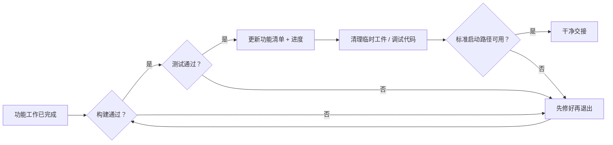
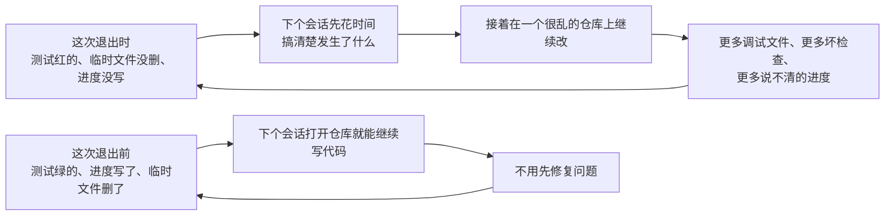

[English Version →](../../../en/lectures/lecture-12-why-every-session-must-leave-a-clean-state/)

> 本篇代码示例：[code/](https://github.com/walkinglabs/learn-harness-engineering/blob/main/docs/zh/lectures/lecture-12-why-every-session-must-leave-a-clean-state/code/)
> 实战练习：[Project 06. 搭建一套完整的 agent 工作环境](./../../projects/project-06-runtime-observability-and-debugging/index.md)

# 第十二讲. 每次会话结束前都做好交接

在使用 AI 编码 agent 进行持续开发时，一个常见的问题是：每个 agent 会话结束时，如果没有刻意做清理，代码库的状态会越来越混乱。举例来说，一个 agent 会话修改了 20 个文件并提交代码后退出，下一个会话启动时，可能发现构建失败、测试变红、临时调试文件散落各处，功能清单和进度记录也没有更新。新会话需要花费大量时间诊断上一个会话做了什么，才能继续工作。

OpenAI 和 Anthropic 都明确指出，长期可靠性取决于操作纪律，单次运行成功并不够。每个会话结束时的状态质量，直接决定下一个会话的效率。这一讲要讨论的，就是如何让每个会话在结束时留下一个干净的状态，让下一个会话可以立刻开始工作。

## 熵增是默认状态

Lehman 的软件演化定律告诉我们：一个持续变更的系统，如果没有人主动管理，它的复杂性一定会增加。这对 AI 编码 agent 来说尤其成立——agent 每次会话都会引入变更，如果不在退出时清理，技术债务会指数级累积。

OpenAI 在 5 个月的 Codex 实验中观察到一个现象：agent 会复制仓库中已有的模式，哪怕那些模式是不一致或次优的。随着时间推移，这种复制必然导致整体质量漂移。打个比方：第一个人在公共区域放了一个杯子，第二个人路过时心想"反正已经乱了"，自己也放了一个。一周后，桌上就堆满了。代码库的退化也是同样的过程。

OpenAI 团队最初每周五花 20% 的工作时间手动清理 agent 留下的烂摊子，但这种做法显然不可持续。他们最终找到了系统性的解决方案：

1. **把好习惯写进仓库规则**：比如"优先使用共享工具包，不要手写 ad-hoc 辅助函数"、"不要瞎猜数据结构，查类型定义或用类型安全 SDK"。这些规则是具体的、机械的、可以自动检查的。
2. **建立周期性清理流程**：一组后台任务定期扫描偏离规则的代码，更新质量评分，自动开重构 PR。大多数 PR 可以在一分钟内审查并自动合并。
3. **人类经验捕获一次，持续执行**：每次代码审查意见、重构 PR、用户报的 bug，都转化为文档更新，或直接编码到检查工具中。文档还不够时，就把规则提升为自动检查的代码。

一句话总结：技术债是高息贷款，持续小额还款比攒到一次性爆雷好得多。

> 来源：[OpenAI: Harness engineering: leveraging Codex in an agent-first world](https://openai.com/index/harness-engineering/)

## 清洁状态：不只是"代码能编译"

清洁状态的要求远比"代码能编译"要多。构建通过是最基本的前提——下一个会话不应该一上来就先修别人的构建错误。所有测试也必须通过，包括会话开始前就存在的旧测试，你这次改动不能破坏已有的功能。而且验证必须在 CI 环境里跑，不是"在我机器上能过就行"。



构建和测试只是底线，还有三条容易被忽略的要求。

第一，当前进度必须记录在机器可读的工件中。具体来说包括三类：已完成的子任务和它的通过标准、正在做但还没做完的子任务和它当前卡在哪、还没开始的子任务。好的进度记录可以减少 60% 到 80% 的会话启动诊断时间。

第二，临时调试产物必须清理干净。调试日志、临时文件、注释掉的代码、TODO 标记，这些东西都会增加下一个会话的认知负担。新会话看到一堆 `console.log('debug')` 和 `// 临时方案，回头改`，根本分不清哪些是有意的、哪些是垃圾。

第三，标准启动路径必须可用。下一个会话能不能不靠人工干预就直接开始工作？环境初始化、代码库加载、上下文获取、任务选择，这些路径中的任何一个被破坏，新会话就无法自行启动工作。



总结一下，一个干净的会话退出需要满足五个条件：构建通过、测试通过、进度已记录、临时工件已清理、启动路径可用。缺一个都不算"做完了"。

## 核心概念

- **清洁状态**：会话退出时必须满足五个条件——构建通过、测试通过、进度已记录、无过时工件、启动路径可用。这五个条件共同构成"做完"的真正定义。
- **会话完整性**：可以类比数据库事务。一个会话的工作要么全部完成并留下清洁状态，要么回滚到上一个一致状态，不存在"做了一半但还行"的中间地带。
- **质量文档**：对代码库中每个模块持续记录质量评分的文件。它是持续更新的，追踪每个模块到底是变强了还是变弱了。
- **清理循环**：定期执行的维护会话，目标是从代码库中系统性地清除积攒的问题。它属于常规保养，不属于紧急修复。就像汽车定期换机油，不等发动机报警才去修。
- **Harness 简化**：随着模型能力提升，定期移除不再必要的 Harness 组件。今天必须有的约束条件，三个月后用更强的模型可能就成了多余开销。
- **幂等清理**：清理脚本无论执行多少次，结果都一样。这意味着清理失败时重跑一遍也安全，不会因为重复执行产生新问题。

## "以后再清理"是永远不清理

最常见的心理陷阱就是"这次来不及清理了，下次再弄"。但下次的 agent 根本不知道你上次留下了什么，它看到的只是一堆混乱的代码和不确定的状态。它得花大量时间推断"这段代码里哪些是有意的，哪些是临时的"。

更糟的是，每个会话都有自己的任务目标。新会话来的时候是为了做新功能，不是为了清理上一个会话遗留问题的。它会直接忽略混乱，在混乱的基础上开始新工作，然后引入更多混乱。这是一个熵增的正反馈循环——越乱越不管，越不管越乱。

数据最能说明问题。下面是一个使用 agent 持续开发 12 周的项目的实际对比：

**没有清洁策略**：

| 时间 | 构建通过率 | 测试通过率 | 新会话启动时间 |
|------|-----------|-----------|---------------|
| 第 1 周 | 100% | 100% | 5 分钟 |
| 第 4 周 | 95% | 92% | 15 分钟 |
| 第 8 周 | 82% | 78% | 35 分钟 |
| 第 12 周 | 68% | 61% | 60+ 分钟 |

**有清洁策略**：

| 时间 | 构建通过率 | 测试通过率 | 新会话启动时间 |
|------|-----------|-----------|---------------|
| 第 1 周 | 100% | 100% | 5 分钟 |
| 第 12 周 | 97% | 95% | 9 分钟 |

12 周下来，两组之间的构建通过率差了 29 个百分点，测试通过率差了 34 个百分点，新会话启动时间差了 85%。这是实测数据，差距已经非常明显。

## 怎么做

### 1. 清洁状态是完成的必要条件

在 Harness 里明确定义：会话完成的条件是两件事同时满足——任务通过验证，且清洁状态检查通过。缺任何一个，会话就不算完成。在项目的 CLAUDE.md 或 AGENTS.md 里可以这样写：

```
## 会话退出检查清单
- [ ] 构建通过 (npm run build)
- [ ] 所有测试通过 (npm test)
- [ ] 功能清单已更新
- [ ] 无调试代码残留 (console.log, debugger, TODO)
- [ ] 标准启动路径可用 (npm run dev)
```

这里解释一下"功能清单"。功能清单（feature list）是一份机器可读的文件，记录了项目中所有功能项的完成状态。每一项功能有三列信息：这个功能具体做什么、用什么命令来验证它、当前状态是什么（未开始/进行中/已阻塞/已通过）。调度器靠功能清单选下一个要做的工作，验证器靠它判断做完没有，交接器靠它生成进度报告。没有功能清单，agent 就不知道"做完"的标准是什么——它可能会用自己的标准判断完成，而你心里的"做完"是完全不同的东西。

### 2. 双模式清理策略

把清理分成两种模式，配合使用：

**即时清理（每个会话结束时）**：清理本次会话创建的临时文件、更新功能清单状态、确保构建和测试全部通过。原则是用完就清，像引用计数一样——谁产生的垃圾谁负责清掉。

**定期清理（每周一次）**：做一次全面的系统扫描，处理累积的结构性问题、更新质量文档、跑基准测试检测整体质量有没有漂移。原则是定期全身体检，不让小问题拖成大病。

### 3. 维护质量文档

质量文档是一份持续更新的文件，对代码库中每个模块打分和评价。新会话一打开就能看到上次会话后每个模块的状态。例：

```markdown
# 质量文档

## 用户认证模块 (质量: A)
- 验证通过: 是
- agent 可理解: 是
- 测试稳定性: 稳定
- 架构边界: 合规
- 代码规范: 遵循

## 支付模块 (质量: C)
- 验证通过: 部分（支付回调未测试）
- agent 可理解: 困难（逻辑分散在 3 个文件）
- 测试稳定性: 不稳定（2 个 flaky 测试）
- 架构边界: 有违规
- 代码规范: 部分遵循
```

有了这份文档，新会话一上来就知道当前代码库的健康状况，优先处理评分最低的模块。从这个角度说，质量文档是 Harness 可观测性的一部分——它让 agent 的运行结果在代码库层面可见。

### 4. 定期简化 Harness

Harness 中每个组件的存在，都源于模型在某个方面尚无法独立完成。随着模型能力不断演进，这些前提会逐渐过时。

Anthropic 的实验直观地展示了这一点。他们最初的 Harness 包含一个任务拆分机制：因为当时的模型一次性处理不了太大的任务，所以需要把大任务先拆成多个小步骤，让模型按顺序逐个完成。当 Opus 4.6 发布后，模型自己就能规划好该怎么一步步做事，不再需要外部帮忙拆解，这个机制反而成了多余的步骤。移除后，Builder Agent 能够连续工作超过两小时而不偏离方向，流程反而更流畅了。

Evaluator 的情况则有所不同。Evaluator 是 Harness 中的评估组件，负责检查生成的代码质量，找出遗漏的功能和未完成的实现。尽管 Opus 4.6 能力更强，当任务难度较高、逼近模型能力的上限时，Evaluator 依然很有用。但如果任务本身很简单，远在模型能力范围之内，Evaluator 可能就是多余的。因此，要不要保留 Evaluator，取决于你的任务有多难、模型有多强——这两者的相对关系才是关键。

推荐做法：每月挑选一个 Harness 组件，暂时禁用它，跑一遍基准任务。如果结果没有退化，就永久移除。如果退化，则恢复该组件，或换一个更轻量的替代方案。

一个更深层的原则：随着模型能力的提升，Harness 中有趣的组合并没有减少，它在位移。过去必须解决的问题被模型增长的能力覆盖了，同时新的能力边界被打开，暴露出过去触及不到的新问题。

### 5. 清理操作必须幂等

幂等的意思是：一个操作无论执行一次还是执行一百次，结果都一样。清理脚本必须具备这个特性，因为清理失败时你会重跑一遍。如果重跑产生不同的结果，就说明清理脚本存在 bug。例：

```bash
# 幂等的清理操作
rm -f /tmp/debug-*.log  # -f 确保文件不存在时不报错
git checkout -- .env.local  # 恢复到已知状态，多跑几次结果相同
npm run test  # 验证清理没有破坏功能
```

### 6. 高吞吐量改变了合并策略

当 agent 的产出远超人类审查能力时，传统的合并策略需要调整。OpenAI 团队的经验是：在一个 agent 每天开出 3.5 个 PR 的环境里，减少阻塞型的合并检查是正确的选择。PR 应该尽快合并，测试偶尔的假失败（flake）用后续运行来修正，不必无限期卡住进度。

这里有一个关键的判断标准：修正一个 bug 的平均成本，和等待人类审查一个 PR 的平均成本，哪个更低？当前者低于后者时，快速合并加上快速修正比慢慢审查更好。

**注意**：这条规则的前提是 agent 的高产出远超过人类的审查带宽。在一个低产出环境里，快速合并没有意义。但在 agent 每天提交几十个 PR 的环境里，等待人工审查的成本远高于修一个漏网 bug 的成本。

## 实际案例

一个使用 agent 持续开发的 Electron 应用，12 周的演化过程：

**无清洁策略（对照组）**：每个会话做完功能就退出，不做额外清理。第 12 周时，构建通过率 68%，测试通过率 61%，新会话启动 60 分钟以上，过时工件 103 个。

**有清洁策略（实验组）**：每个会话结束时执行完整清洁检查，加上每周一次清理循环。第 12 周时，构建通过率 97%，测试通过率 95%，新会话启动 9 分钟，过时工件 11 个。

到第 12 周，实验组的构建通过率比对照组高 29 个百分点，测试通过率高 34 个百分点，新会话启动时间减少 85%。每个会话只多花 5 分钟做清理，12 周下来却省了几十个小时的混乱时间。

## 核心要点

- **清洁状态是会话完成的必要条件**。它是"完成"定义的一部分，属于必要条件。代码写完了但状态是脏的，那就不算做完。
- **五个维度缺一不可**：构建、测试、进度、工件、启动。每一条都要在退出时显式检查，不能靠"感觉应该没问题"。
- **功能清单让 agent 知道"做完"的标准**。没有清单，agent 用自己的标准判断完成，那个标准几乎一定比你的标准低。
- **质量文档让代码库的健康状况可追踪**。知道哪里在退化，才能主动修复。不知道问题在哪儿，就只能等它爆发。
- **定期简化 Harness**：随着模型能力提升，主动移除不再必要的组件。今天必须有的约束，三个月后可能就是累赘。
- **"以后再清理"等于永远不清理**。熵增是默认方向，只有主动的清洁操作才能对抗它。每次多花五分钟，长期来看是回报最高的投资。

## 延伸阅读

- [Clean Code - Robert C. Martin](https://www.goodreads.com/book/show/3735293-clean-code) — 代码整洁之道的经典著作，清洁状态背后的软件工程原则
- [Harness Engineering - OpenAI](https://openai.com/index/harness-engineering/) — OpenAI 团队在 agent 时代如何通过 Harness 设计确保可重复性
- [Effective Harnesses for Long-Running Agents - Anthropic](https://www.anthropic.com/engineering/effective-harnesses-for-long-running-agents) — Anthropic 的长期运行 agent 实践，清洁会话退出对可靠性的关键作用
- [Programs, Life Cycles, and Laws of Software Evolution - Lehman](https://ieeexplore.ieee.org/document/1702314) — 软件演化定律的原始论文，证明了无主动维护时系统复杂性必然增长
- 第八讲：[用功能清单约束 agent 该做什么](./../lecture-08-why-feature-lists-are-harness-primitives/index.md) — 如何用功能清单给 agent 明确的完成标准
- 第九讲：[防止 agent 提前宣告完成](./../lecture-09-why-agents-declare-victory-too-early/index.md) — 如何通过验证机制避免 agent 过早说"做完了"
- 第十讲：[跑通完整流程才算真正验证](./../lecture-10-why-end-to-end-testing-changes-results/index.md) — 为什么端到端测试是唯一可靠的完成验证
- 第十一讲：[让 agent 的运行过程可观测](./../lecture-11-why-observability-belongs-inside-the-harness/index.md) — 如何通过可观测性让 agent 的运行状态不再是一个黑盒
- 第五讲：[让跨会话的任务保持上下文连续](./../lecture-05-why-long-running-tasks-lose-continuity/index.md) — 会话交接的前置知识，如何让新会话快速接上

## 练习

1. **设计你的清洁状态检查表**：为你的代码库设计一个会话退出检查表，涵盖五个维度（构建、测试、进度、工件、启动）。在接下来的 5 个连续会话中坚持执行，记录每个维度上违反了几次。

2. **基准对比实验**：选定一个固定的任务集，分别在两种 Harness 配置下跑一遍——一种要求清洁状态检查通过才算完成，另一种不要求。比较两组的完成率、重试次数和漏网 bug 的数量。

3. **Harness 简化实践**：从你的 Harness 里选一个组件，暂时禁用它，跑一遍基准任务。比较有它和没它的结果，然后决定是保留、移除还是换一个更轻量的替代方案。

4. **质量文档入门**：为你的项目创建第一份质量文档。挑 3 到 5 个核心模块，给每个模块打分（A/B/C/D），标注具体的扣分原因。在接下来的 4 周里，每周更新一次评分，观察质量是变好了还是变差了。
